# LumiSquare
LumiSquare is a handheld 4x4 LED button game console built around an ATSAMD21J18A. Each of the sixteen silicone pads sits on top of its own RGB LED, and a single 16-channel constant-current driver paints all forty-eight color channels through a column-multiplexed matrix. The console ships with three games, spoken score readout through a DFPlayer Mini, a tone buzzer for note feedback, and a USB-C rechargeable power path that lets the device be played while it charges.

- Project Video (YouTube): https://youtu.be/QTP0zEY1d-M?si=SdRo0hkOKRWzujol
- Multiplexed Display: https://en.wikipedia.org/wiki/Multiplexed_display
- Keyboard Matrix Circuit (diode anti-ghosting): https://en.wikipedia.org/wiki/Keyboard_matrix_circuit
- STP16CPC05 Constant Current LED Driver: https://www.st.com/en/power-management/stp16cpc05.html
- DFPlayer Mini Documentation: https://wiki.dfrobot.com/DFPlayer_Mini_SKU_DFR0299

<div align="center">
	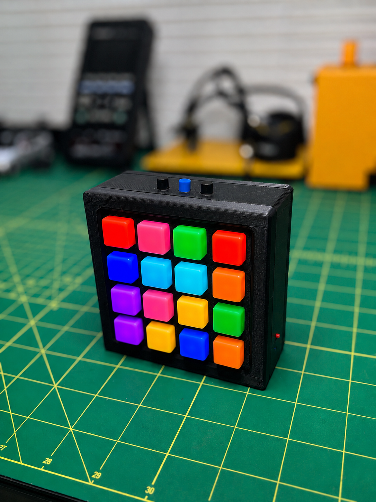
</div>

## Table of Contents
1. [Software Used](#software)
2. [Main Control Board Circuit](#maincontrolboard)
    - [Power Path and Battery Charging](#powerpath)
    - [LED Button Matrix Driver](#leddriver)
    - [Button Matrix Circuit](#buttonmatrixcircuit)
    - [Buzzer Control](#buzzercontrol)
    - [DF Player Mini](#dfplayer)
    - [Game Firmware](#gamefirmware)
        - [Simon](#simon)
        - [Memory Matching](#memorymatching)
        - [Light Dash](#lightdash)
    - [Power Consumption](#powerconsumption)
    - [Charging Notes](#charging)
    - [Parts List](#partslist)
    - [Schematics](#schematics)
    - [PCB Images](#pcbimages)
3. [Pin Mapping](#pinmapping)
    - [DF Player Mini](#dfplayerpins)
    - [Buzzer](#buzzerpins)
    - [LED Mapping](#ledmapping)
    - [4x4 Button Mapping](#buttonmapping)
4. [STL Viewer](#stlviewer)
    - [Full Design](#fulldesign)
    - [Face Plate](#faceplate)
    - [Back Cover](#backcover)
    - [Main Body](#mainbody)
    - [Main Control Board](#maincontrolboardstl)

## 1. Software Used<a name="software"></a>
- VSCode: https://code.visualstudio.com
- OpenOCD (Arm GDB Bridge): https://openocd.org/pages/about.html
- Arm GNU Toolchain (programming and debugging): https://developer.arm.com/tools-and-software/gnu-toolchain
- KiCad (PCB Design): https://www.kicad.org
- Autodesk Fusion (Parts Design): https://www.autodesk.com/products/fusion-360/overview

The firmware is a CMake project with two presets. `cmake_generate_debug` / `cmake_build_debug` cross compile for the SAMD21 with `arm-none-eabi-gcc` (Cortex-M0+, `F_CPU=48000000`) and emit an `.elf`, `.hex`, and `.bin`. `cmake_generate_desktop` / `cmake_build_desktop` build the same game code as a desktop executable with `DESKTOP_SIMULATION` defined, which swaps the SAMD21 hardware layer for an ImGui/GLFW/miniaudio implementation so the games, LED colors, and audio can be developed without the board. Flashing and debugging is done over the Samtec FTSH-105 SWD header using OpenOCD as the GDB bridge for `arm-none-eabi-gdb`.

## 2. Main Control Board Circuit<a name="maincontrolboard"></a>
The main control board carries everything except the switches and LEDs themselves: the USB-C charger, the battery power path, both boost converters, the 3.3 V regulator, the SAMD21, the LED driver and its column drivers, the tone buzzer, and the DFPlayer Mini. It connects to the button matrix board through two 12-pin headers, one carrying the twelve LED cathode channels and one carrying the four button rows, four button columns, and four LED column anodes.

<div align="center">
 <table>
     <tr>
         <td>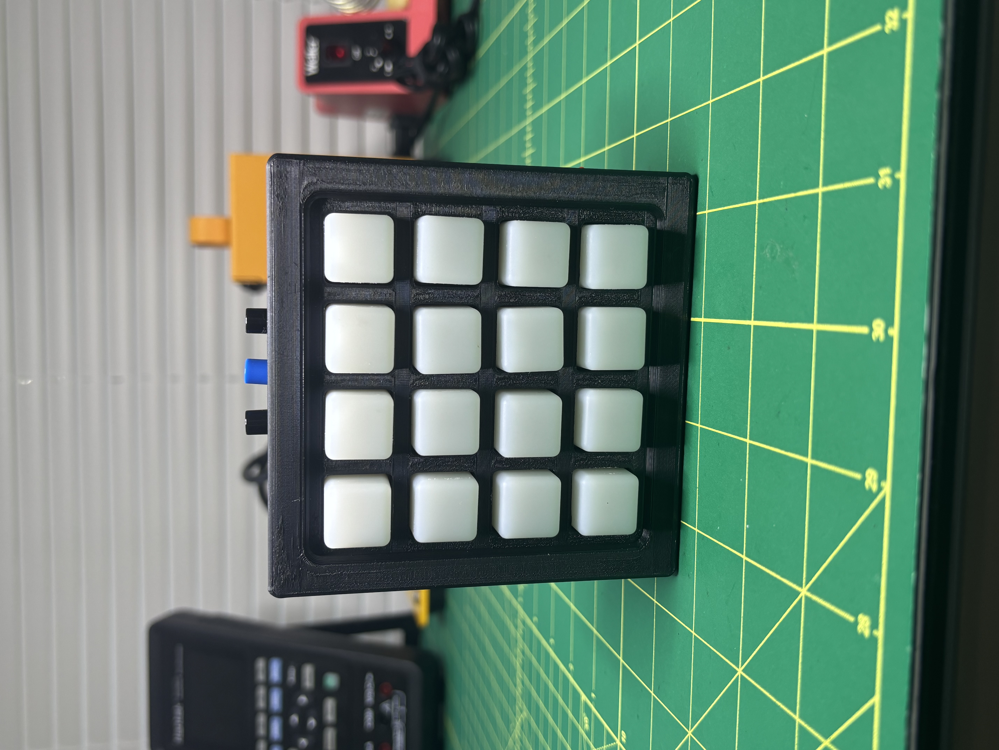</td>
         <td>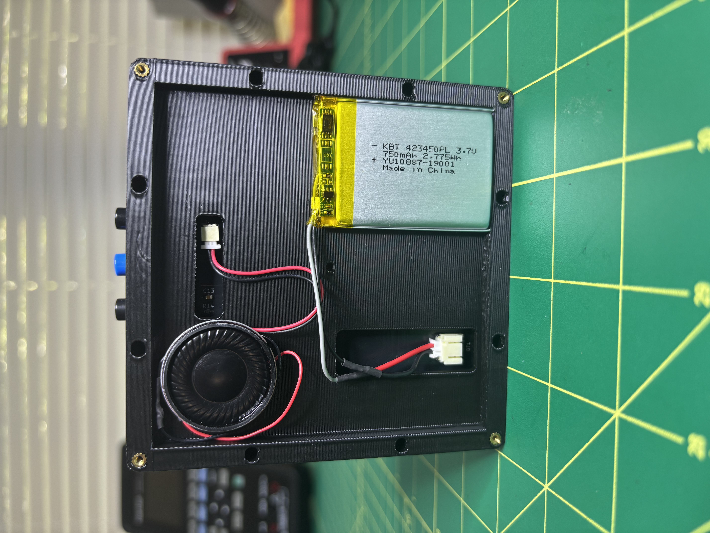</td>
     </tr>
     <tr>
         <td>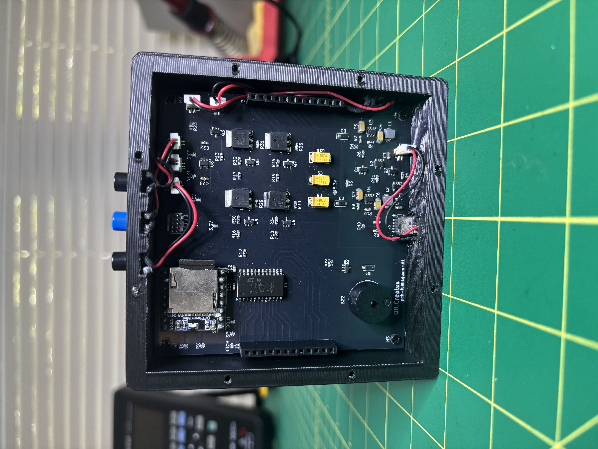</td>
         <td>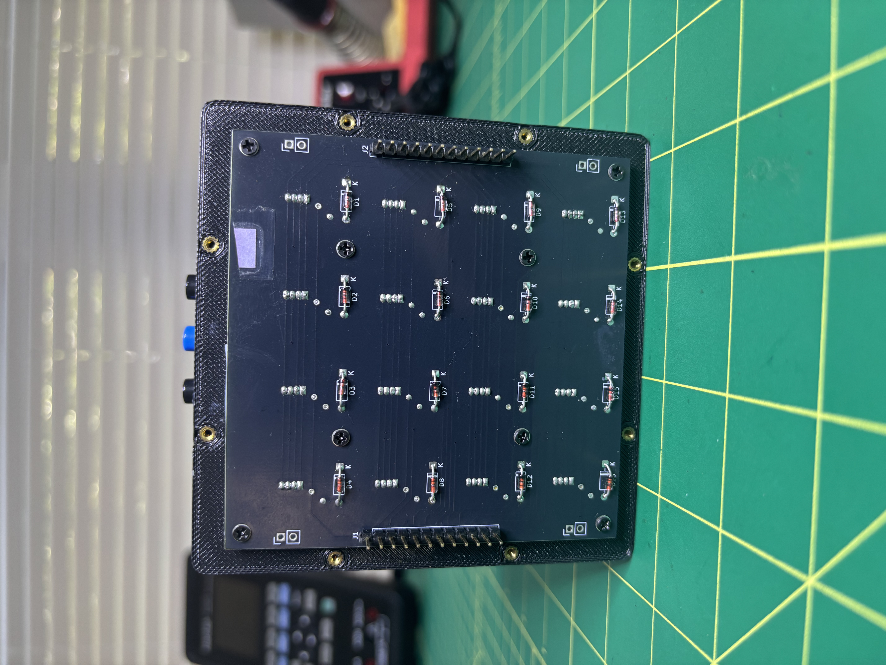</td>
     </tr>
 </table>
</div>

### Power Path and Battery Charging<a name="powerpath"></a>
The board runs from either a single cell LiPo or USB-C, and the two sources are kept electrically separate so the device can be used while it charges.

Charging is handled by an MCP73831-2-OT (U1) off the USB-C VBUS rail. The USB-C receptacle is a power-only 6-pin part with the two 5.1k CC pulldowns (R1, R2) needed to advertise a sink. The charge current is set by the PROG resistor:

- Charge current = 1000 V / R3 = 1000 V / 10 kohm = 100 mA

A status LED (D1) with a 330 ohm series resistor (R4) is driven from the STAT pin.

The power path itself is built from two TLV61070A boost converters and a P-channel pass device:

- Q2 (IRLML2246) sits between the battery and the battery-side boost converter. Its gate is tied to the 5 V USB rail and pulled to ground through R11 (220k). With no USB present the gate sits at 0 V and the MOSFET conducts; when USB is plugged in the gate is pulled to 5 V and the battery is disconnected from the system load.
- U3 (TLV61070A) is the battery boost converter. Its enable pin is pulled up to the battery through R6 (150k) and is gated two ways: a TPS3840 (U2) supervisor pulls it low on battery undervoltage, and Q1 (IRLML6244) pulls it low whenever the 5 V USB rail is present.
- U4 (TLV61070A) is the USB boost converter. Its enable pin is tied to its own input, so it runs whenever USB power is present.
- Both converters use a 4.7uH inductor and the same 720k/80k feedback divider, and their outputs are combined onto the 5.3 V rail through Schottky diodes (D2, D3, 1N5819HW-7-F) with 300uF of bulk capacitance (C8, C9, C10).

Downstream of the 5.3 V rail, SW1 is the system power switch feeding a MIC5225-3.3YM5 (U8) that produces the +3.3 V Main rail for the SAMD21, the DFPlayer Mini, and the buzzer. The 5.3 V rail itself powers the LED column drivers, so the RGB LEDs get their headroom from the boost output rather than the regulated logic rail.

### LED Button Matrix Driver<a name="leddriver"></a>
Sixteen common-anode RGB LEDs are driven as a 4x4 multiplexed matrix. Anodes are shared per column, and cathodes are shared per row and color, which reduces forty-eight LED channels down to twelve driver channels plus four column selects.

The cathode side is an STP16CPC05MTR (U6) constant-current sink. Twelve of its sixteen channels are used, one for each row and color combination, and a 200 ohm resistor (R12) on R-EXT sets the per-channel current for all of them. The MCU talks to it over SERCOM4 in SPI master mode (MSB first, 16 bits per update), with a separate GPIO line used to pulse the latch.

The anode side is a high-side switch per column. Each column select from the MCU drives an MMBT3904 (Q4-Q7) through a 2.2k base resistor with a 47k pulldown; the transistor pulls the gate of a TSM680P06CH P-channel MOSFET (Q15-Q18) down against a 100k pullup to the 5.3 V rail, and the MOSFET drain feeds that column's anode line.

Color depth comes from binary code modulation rather than a per-channel PWM peripheral. Each LED stores its color as eight bit planes in `ledColorData[column][row][plane]`. `refreshLeds()` services one LED per call: it enables that LED's column, then shifts out all eight planes back to back, holding plane *i* for 2^i NOP loops so the planes carry the same weighting as the bits of an 8-bit value. After the last plane the driver is cleared to `0x0000` and the next LED index is selected. Only one column ever sources current at a time, and the sixteen LED slots repeat fast enough that the display looks continuous.

Per-LED intensity is a scale from 0 to 1 applied to the color before the bit planes are rebuilt, so the games can dim a pad (the idle Simon pads sit at 0.2 intensity, for example) without changing its color.

### Button Matrix Circuit<a name="buttonmatrixcircuit"></a>
The button matrix board holds the sixteen switches, the sixteen RGB LEDs, and nothing else. Switches are wired as a standard 4x4 matrix with a 1N4148 diode in series with every switch (D1-D16) so that simultaneous presses cannot ghost onto unrelated rows. The MCU drives one column low at a time and reads the four row inputs, which are held high by internal pullups, so a pressed button reads as a logic low on its row while its column is active.

The LEDs on this board are wired to match. Anodes are commoned per column (LED_COL1 through LED_COL4) and cathodes are commoned per row and color (LED_R1/G1/B1 through LED_R4/G4/B4). Both groups leave the board on 12-pin headers that mate with the main control board.

**Assembly notes for the button pad:**

- The 4x4 silicone button pad in the parts list is not the right size for this enclosure. The individual pads have to be cut out of the sheet and placed into the pockets in the face plate.
- If you have the button matrix board fabricated, order it with an immersion gold (ENIG) finish. The exposed contact pads need a gold surface for the conductive pill on the bottom of each silicone button to make reliable contact.
- If the board is made with a plain finish instead, buy the copper tape listed in the parts list and adhere a piece to the bottom of each button pad so that the button can bridge the traces.

### Buzzer Control<a name="buzzercontrol"></a>
Tones are produced by a magnetic transducer (BZ2, RDT-4.000-1375-NS1) switched on the low side by an MMBT3904 (Q8). The base is driven through a 2.2k resistor (R22) from the MCU, and a 1N4148W (D4) across the transducer clamps the inductive kickback back into the +3.3 V rail.

The drive signal is hardware PWM from TC7 on PB23. TC7 runs from the 48 MHz main clock with a divide-by-256 prescaler in match PWM mode:

- Timer clock = 48 MHz / 256 = 187.5 kHz
- Output frequency = 187500 / (CC0 + 1)
- `CC1` is always set to `CC0 / 2`, which holds the duty cycle at 50 percent regardless of pitch

Because the period register alone determines pitch, the `MusicNote` enum stores CC0 values directly instead of frequencies. For example `MusicNote::C4 = 716`, which gives 187500 / 717 = 261.5 Hz. Starting and stopping a note is just enabling or disabling the timer, so note timing stays exact while the game loop is busy elsewhere.

### DF Player Mini<a name="dfplayer"></a>
Spoken audio comes from a DFPlayer Mini (DFR0299) running off the +3.3 V rail, with its speaker outputs broken out to a JST connector. The module is driven from SERCOM5 in USART mode on PA20/PA21 at 9600 baud.

Every DFPlayer command is a fixed 10-byte frame (`0x7E 0xFF 0x06 <cmd> 0x00 <param hi> <param lo> <checksum hi> <checksum lo> 0xEF`). Rather than building those frames at runtime, the firmware stores all of them precomputed in a constant table, so playing a clip is a table lookup. Frames are pushed out by DMAC channel 0 triggered off the SERCOM5 transmit event, one beat per trigger, so the game loop never blocks on the UART.

Replies come back through the SERCOM5 receive interrupt, which buffers the module's 20-byte response (the command acknowledgement plus the playback-finished frame) and fires a completion callback when the terminating `0xEF` arrives. That callback is what advances queued voice-over sequences, which is how the console reads a multi-digit score back as separate clips.

Audio content is organized into four folders on the SD card, and the command table plays from them by folder and track number:

| Folder | Contents |
|:--|:--|
| 01 | Digits 0 through 9 |
| 02 | 10 through 20, then 30, 40, 50, 60, 70, 80, 90 |
| 03 | 100, 200, 300, 400, 500 |
| 04 | Phrases: "your score is", "new high score", the game names, the difficulty names, countdown, mute, unmute |

To read a score such as 342, the firmware queues the hundreds clip, then the tens clip, then the ones clip, and lets the completion callback chain them together. Volume is set with command `0x06`; the unmute command sends a value of 25, and muting sends a value of 0.

### Game Firmware<a name="gamefirmware"></a>
The firmware is a fixed-timestep game engine. TC3 runs from the 48 MHz clock with a divide-by-1024 prescaler and is preloaded so it overflows every 16 ms, giving a 62.5 Hz update rate. The main loop looks like this:

```cpp
while (true)
{
    LEDMatrix::refreshLeds();

    if (!DeviceUtility::fixedUpdate)
        continue;

    DeviceUtility::fixedUpdate = false;
    Input::pollButtons();

    StateManager::Instance().onFixedUpdate();
    AudioSource::Instance().onFixedUpdate();
    ShutdownUtility::Instance().onFixedUpdate();
    SerialCommandManager::Instance().onFixedUpdate();
}
```

LED refresh runs as fast as the CPU allows, while everything else is gated on the 16 ms tick. All game timers are expressed in milliseconds and decremented by `DeviceUtility::DELTA_TIME`, so game speed is independent of how quickly the LED refresh happens to be running.

All hardware access goes through an abstract `DeviceUtility` singleton. `SAMD21J18Utility` implements it against the real peripherals, and `DesktopUtility` implements the same interface with ImGui, GLFW, and miniaudio. Every layer above it (games, LED matrix, input, audio, scoring) is shared between the two builds.

Game flow is a state machine. `StateManager` holds one instance of each state and dispatches `enterState`, `updateState`, `exitState`, and `onButtonPressed` to whichever one is current:

| State | Purpose |
|:--|:--|
| PowerOn | Startup animation and audio |
| Menu | Game selection, difficulty selection, mute toggle, start countdown |
| MemoryMatching | Color pair matching game |
| Simon | Sequence memorization game |
| LightDash | Timed reaction game |
| GameOver | Score readout and high score announcement |

In the menu, the Next and Previous buttons cycle through the three games and the Difficulty button cycles Easy, Medium, Hard. Holding the Difficulty button for one second toggles mute instead of changing difficulty, and the new mute state is announced through the DFPlayer. Selecting a game plays a spoken 3-2-1 countdown before the state switch.

`ScoreManager` tracks the current score and a high score per game and per difficulty in a 6x3 matrix. Note that `StorageService`, the flash-backed persistence layer for those high scores, is currently stubbed out, so high scores are held in RAM and reset on power cycle.

#### Simon<a name="simon"></a>
The console plays a growing sequence of lit pads with a distinct note per pad, and the player repeats it. Only eight of the sixteen pads are playable. On Easy the four center pads are used (indexes 5, 6, 9, 10); on Medium and Hard the four corners (0, 3, 12, 15) are added. Each playable pad has a fixed note assignment:

| Pad Index | Note | Pad Index | Note |
|:--:|:--:|:--:|:--:|
| 5 | G4 | 4 | A4 |
| 6 | C4 | 7 | D4 |
| 9 | E4 | 8 | F4 |
| 10 | G3 | 11 | B3 |

The player gets three lives on Easy and Medium and a single life on Hard. Idle pads sit at 0.2 intensity and the active pad steps up to full intensity for each sequence element, so the sequence reads clearly without the board going dark between steps.

#### Memory Matching<a name="memorymatching"></a>
Eight color pairs are shuffled across the sixteen pads at the start of the round. Pressing a pad lights it in its hidden color; pressing a second pad evaluates the guess. Matched pairs stay lit, mismatched pads fade back off after a short reveal timer, and the round ends once all eight matches are found. Selection and evaluation are confirmed with C5 and D5 tones.

#### Light Dash<a name="lightdash"></a>
A 30 second timed reaction round. Five pads start lit in turquoise, and every lit pad carries its own randomized turn-off timer. Hitting a lit pad scores a point and immediately lights a new random pad; hitting a dark pad deducts points and plays a low B3. Difficulty changes the pressure directly:

| Difficulty | LED Turn-Off Window | Score Deduction | Bonus Pad Value | Bonus Window | Power-Ups |
|:--|:--:|:--:|:--:|:--:|:--:|
| Easy | 1500 - 2500 ms | -1 | 5 | 400 ms | Disabled |
| Medium | 1000 - 2000 ms | -2 | 3 | 500 ms | Enabled |
| Hard | 750 - 1200 ms | -3 | 5 | 400 ms | Enabled |

### Power Consumption<a name="powerconsumption"></a>
This power system was sized around continuous play with the LED matrix, the DFPlayer Mini, and the buzzer all active, measured on the finished assembly rather than estimated from datasheet maximums.

Measured load envelope:

- USB input, playing while charging: ~170 mA typical, 200 mA maximum
- Battery draw with USB disconnected: ~100 mA typical, 120 mA maximum
- Programmed battery charge current (MCP73831 with a 10k PROG resistor): 100 mA

The USB figure is the total of both jobs at once: the system load through the USB boost converter plus the 100 mA going into the battery. Against the 500 mA available from a standard USB port:

- Worst-case USB draw: 0.20 A of the 0.50 A available
- Remaining headroom: 0.30 A, roughly 40 percent port utilization

Battery capability and runtime with a 750 mAh single cell LiPo:

- Typical: 750 mAh / 100 mA = 7.5 h
- Worst case: 750 mAh / 120 mA = 6.25 h

That works out to roughly 6 to 7.5 hours of continuous play per charge, with the practical number landing near the low end of that range because the boost converter draws more input current as the cell voltage falls toward its cutoff. A full recharge from empty at 100 mA takes about 8 hours once the constant-voltage taper at the end of the charge cycle is included.

Conclusion: the USB port has roughly 300 mA of unused headroom even in the worst case, so charging and full-brightness play can happen at the same time without exceeding what a standard port supplies.

### Charging Notes<a name="charging"></a>
The device can be safely used while charging due to its power-path design. When USB power is connected, the battery-powered boost converter is disabled and the battery is isolated from the system load, allowing it to charge independently at 100 mA. The system is powered through a separate boost converter from USB power during this time. Since the combined system load and charging current remain well below the 500 mA available from a standard USB port, normal operation can continue while the battery is charging.

---
### Parts List<a name="partslist"></a>
<div align="center">
    <table>
        <tr>
            <td valign="top">
                <table>
                    <tr><th>Reference</th><th>Part</th><th>Quantity</th></tr>
                    <tr><td align="center">BT1</td><td><a href="https://www.amazon.com/dp/B0B21B262L?ref=ppx_yo2ov_dt_b_fed_asin_title&amp;th=1">4.2V Lipo</a></td><td align="center">x1</td></tr>
                    <tr><td align="center">&mdash;</td><td><a href="https://www.digikey.com/en/products/detail/jst-sales-america-inc/S2B-PH-SM4-TB/926655">S2B-PH-SM4-TB</a></td><td align="center">x1</td></tr>
                    <tr><td align="center">BZ2</td><td><a href="https://www.digikey.com/en/products/detail/raltron-electronics/RDT-4-000-1375-NS1/22320849">RDT-4.000-1375-NS1</a></td><td align="center">x1</td></tr>
                    <tr><td align="center">C1,C2</td><td><a href="https://www.digikey.com/en/products/detail/samsung-electro-mechanics/CL10A475KP8NNNC/3886702">4.7uF</a></td><td align="center">x2</td></tr>
                    <tr><td align="center">C14,C15,C22</td><td><a href="https://www.digikey.com/en/products/detail/kyocera-avx/TPCL105M010R5000/1472496">1uF tantalum</a></td><td align="center">x3</td></tr>
                    <tr><td align="center">C3,C13</td><td><a href="https://www.digikey.com/en/products/detail/taiyo-yuden/TMK107B7105KA-T/2714162">1uF</a></td><td align="center">x2</td></tr>
                    <tr><td align="center">C4,C6</td><td><a href="https://www.digikey.com/en/products/detail/murata-electronics/GCM31CR71C106KA64K/2592432">10uF</a></td><td align="center">x2</td></tr>
                    <tr><td align="center">C5,C7</td><td><a href="https://www.digikey.com/en/products/detail/murata-electronics/GCM31CR70J226ME23L/2592428">22uF</a></td><td align="center">x2</td></tr>
                    <tr><td align="center">C8,C9,C10</td><td><a href="https://www.digikey.com/en/products/detail/kyocera-avx/TAJC107K010RNJ/563809">100uF</a></td><td align="center">x3</td></tr>
                    <tr><td align="center">C11</td><td><a href="https://www.digikey.com/en/products/detail/kemet/C0603C102K5RACTU/411081">.001uF</a></td><td align="center">x1</td></tr>
                    <tr><td align="center">C12</td><td><a href="https://www.digikey.com/en/products/detail/kemet/C0603C103K5RACTU/411090">.01uF</a></td><td align="center">x1</td></tr>
                    <tr><td align="center">C16,C17,C18,C19,C20,C21</td><td><a href="https://www.digikey.com/en/products/detail/kemet/C0603C104K3RACTU/416044">.1uF</a></td><td align="center">x6</td></tr>
                    <tr><td align="center">C23</td><td><a href="https://www.digikey.com/en/products/detail/murata-electronics/GRM188R61E225KA12D/4905349">2.2uF</a></td><td align="center">x1</td></tr>
                    <tr><td align="center">D1,D5</td><td>LED</td><td align="center">x2</td></tr>
                    <tr><td align="center">D2,D3</td><td><a href="https://www.digikey.com/en/products/detail/diodes-incorporated/1N5819HW-7-F/814970">1N5819HW-7-F</a></td><td align="center">x2</td></tr>
                    <tr><td align="center">D4</td><td><a href="https://www.digikey.com/en/products/detail/smc-diode-solutions/1N4148W/6022450">1N4148W</a></td><td align="center">x1</td></tr>
                    <tr><td align="center">J2,J3</td><td><a href="https://www.amazon.com/2-54mm-Breakaway-Female-Connector-Arduino/dp/B01MQ48T2V/ref=sr_1_2_sspa?crid=16L90K4M3IPUJ&amp;dib=eyJ2IjoiMSJ9.PiVZGqfONIcta-M5ftDeSQvccVRmw9BxQL2rt7zLLUlXX1aAbZE0DyQvFnNRSX7J1oJEA5hJfbgi6EJ3rHkMxb469SjCBiPbG4t4CkfheX_9W7Yiw4iFecXODu6yRoJ7FvokpWTZ5C9jK1dhZLU-0gXDsoVq96wH-NXO7UmstsQCzrZOSzCfbpis861lxSzX91fkbaxrOKRMrX-EQ3cjwH1Og4xyfn4PJ6o445uHR2s.cW7WMcxh5mXZc1T8bR0I8nLIh45-W5JJZGus4sUdDDI&amp;dib_tag=se&amp;keywords=Male+headers&amp;qid=1783892715&amp;sprefix=male+header%2Caps%2C141&amp;sr=8-2-spons&amp;sp_csd=d2lkZ2V0TmFtZT1zcF9hdGY&amp;psc=1">Conn_01x12</a></td><td align="center">x2</td></tr>
                    <tr><td align="center">J5</td><td><a href="https://www.digikey.com/en/products/detail/gct/USB4125-GF-A/13547388">USB_C_Receptacle_PowerOnly_6P</a></td><td align="center">x1</td></tr>
                    <tr><td align="center">J7</td><td><a href="https://www.digikey.com/en/products/detail/samtec-inc/FTSH-105-01-L-DV-K/1875039">FTSH-105-01-X-DV-P-K-X</a></td><td align="center">x1</td></tr>
                    <tr><td align="center">L1,L2</td><td><a href="https://www.digikey.com/en/products/detail/bourns-inc/SRP3020TA-4R7M/9350997">4.7uH</a></td><td align="center">x2</td></tr>
                    <tr><td align="center">Q1</td><td><a href="https://www.digikey.com/en/products/detail/infineon-technologies/IRLML6244TRPBF/2393871">IRLML6244</a></td><td align="center">x1</td></tr>
                    <tr><td align="center">Q2,Q3</td><td><a href="https://www.digikey.com/en/products/detail/umw/UMWIRLML2246TR/24889419">UMWIRLML2246TRCT</a></td><td align="center">x2</td></tr>
                    <tr><td align="center">Q4,Q5,Q6,Q7,Q8</td><td><a href="https://www.digikey.com/en/products/detail/onsemi/MMBT3904LT1G/919601">MMBT3904</a></td><td align="center">x5</td></tr>
                    <tr><td align="center">Q15,Q16,Q17,Q18</td><td><a href="https://www.digikey.com/en/products/detail/taiwan-semiconductor-corporation/TSM680P06CH-X0G/7360503">TSM680P06CH</a></td><td align="center">x4</td></tr>
                    <tr><td align="center">R1,R2</td><td><a href="https://www.digikey.com/en/products/detail/yageo/RC0603FR-075K1L/727268">5.1k</a></td><td align="center">x2</td></tr>
                    <tr><td align="center">R3,R21</td><td><a href="https://www.digikey.com/en/products/detail/stackpole-electronics-inc/RMCF0603JT10K0/1758104">10k</a></td><td align="center">x2</td></tr>
                    <tr><td align="center">R4,R23</td><td><a href="https://www.digikey.com/en/products/detail/yageo/RC0603FR-07330RL/727162">330</a></td><td align="center">x2</td></tr>
                    <tr><td align="center">R5</td><td><a href="https://www.digikey.com/en/products/detail/yageo/RC0603JR-071K3L/726686">1.3k</a></td><td align="center">x1</td></tr>
                    <tr><td align="center">R6</td><td><a href="https://www.digikey.com/en/products/detail/koa-speer-electronics-inc/RK73B1JTTD154J/9844780">150k</a></td><td align="center">x1</td></tr>
                </table>
            </td>
            <td width="24"></td>
            <td valign="top">
                <table>
                    <tr><th>Reference</th><th>Part</th><th>Quantity</th></tr>
                    <tr><td align="center">R7,R9</td><td><a href="https://www.digikey.com/en/products/detail/yageo/RC0603FR-07715KL/727372">720k</a></td><td align="center">x2</td></tr>
                    <tr><td align="center">R8,R10</td><td><a href="https://www.digikey.com/en/products/detail/yageo/RC0603JR-0775KL/726828">80k</a></td><td align="center">x2</td></tr>
                    <tr><td align="center">R11</td><td><a href="https://www.digikey.com/en/products/detail/stackpole-electronics-inc/RMCF0603FT220K/1760805">220k</a></td><td align="center">x1</td></tr>
                    <tr><td align="center">R12</td><td><a href="https://www.digikey.com/en/products/detail/rohm-semiconductor/ESR03EZPF2000/1983436">200</a></td><td align="center">x1</td></tr>
                    <tr><td align="center">R13,R29,R31,R33,R35</td><td><a href="https://www.digikey.com/en/products/detail/yageo/RC0603FR-07100KL/726889">100k</a></td><td align="center">x5</td></tr>
                    <tr><td align="center">R14,R15,R20</td><td><a href="https://www.digikey.com/en/products/detail/panasonic-industry/ERA-3AEB153V/1465882">15k</a></td><td align="center">x3</td></tr>
                    <tr><td align="center">R16,R17,R18,R19,R22</td><td><a href="https://www.digikey.com/en/products/detail/yageo/RC0603FR-072K2L/727016">2.2k</a></td><td align="center">x5</td></tr>
                    <tr><td align="center">R30,R32,R34,R36</td><td><a href="https://www.digikey.com/en/products/detail/yageo/RC0603FR-0747KL/727253">47k</a></td><td align="center">x4</td></tr>
                    <tr><td align="center">SW1</td><td><a href="https://www.amazon.com/2-54mm-Breakaway-Female-Connector-Arduino/dp/B01MQ48T2V/ref=sr_1_2_sspa?crid=16L90K4M3IPUJ&amp;dib=eyJ2IjoiMSJ9.PiVZGqfONIcta-M5ftDeSQvccVRmw9BxQL2rt7zLLUlXX1aAbZE0DyQvFnNRSX7J1oJEA5hJfbgi6EJ3rHkMxb469SjCBiPbG4t4CkfheX_9W7Yiw4iFecXODu6yRoJ7FvokpWTZ5C9jK1dhZLU-0gXDsoVq96wH-NXO7UmstsQCzrZOSzCfbpis861lxSzX91fkbaxrOKRMrX-EQ3cjwH1Og4xyfn4PJ6o445uHR2s.cW7WMcxh5mXZc1T8bR0I8nLIh45-W5JJZGus4sUdDDI&amp;dib_tag=se&amp;keywords=Male+headers&amp;qid=1783892715&amp;sprefix=male+header%2Caps%2C141&amp;sr=8-2-spons&amp;sp_csd=d2lkZ2V0TmFtZT1zcF9hdGY&amp;psc=1">SW_SPST</a></td><td align="center">x1</td></tr>
                    <tr><td align="center">&mdash;</td><td><a href="https://www.digikey.com/en/products/detail/jst-sales-america-inc/SM02B-NSHSS-TB/3313627">SM02B-NSHSS-TB</a></td><td align="center">x1</td></tr>
                    <tr><td align="center">&mdash;</td><td><a href="https://www.amazon.com/dp/B0FD32HBD2?ref=ppx_yo2ov_dt_b_fed_asin_title">JST SH 1.0mm 2-Pin Connector Male</a></td><td align="center">x6</td></tr>
                    <tr><td align="center">&mdash;</td><td><a href="https://www.digikey.com/en/products/detail/jst-sales-america-inc/BM02B-SRSS-TB/926694">455-1788-1-ND</a></td><td align="center">x6</td></tr>
                    <tr><td align="center">&mdash;</td><td><a href="https://www.digikey.com/en/products/detail/e-switch/TL3342F260QG/4029402">TL3342F260QG</a></td><td align="center">x1</td></tr>
                    <tr><td align="center">SW2,SW3,SW4,SW5</td><td><a href="https://www.amazon.com/dp/B07FS9CLHB?ref=ppx_yo2ov_dt_b_fed_asin_title">SW_Push</a></td><td align="center">x3</td></tr>
                    <tr><td align="center">U1</td><td><a href="https://www.digikey.com/en/products/detail/microchip-technology/MCP73831T-4ADI-OT/1874437">MCP73831-2-OT</a></td><td align="center">x1</td></tr>
                    <tr><td align="center">U2</td><td><a href="https://www.digikey.com/en/products/detail/texas-instruments/TPS3840DL35DBVR/15857118">TPS3840</a></td><td align="center">x1</td></tr>
                    <tr><td align="center">U3,U4</td><td><a href="https://www.digikey.com/en/products/detail/texas-instruments/TLV61070ADBVR/16982069">TLV61070A</a></td><td align="center">x2</td></tr>
                    <tr><td align="center">U5</td><td><a href="https://www.digikey.com/en/products/detail/microchip-technology/ATSAMD21J18A-AUT/4878863">ATSAMD21J18A-A</a></td><td align="center">x1</td></tr>
                    <tr><td align="center">U6</td><td><a href="https://www.digikey.com/en/products/detail/stmicroelectronics/STP16CPC05MTR/2021162">STP16CPC05MTR</a></td><td align="center">x1</td></tr>
                    <tr><td align="center">U8</td><td><a href="https://www.digikey.com/en/products/detail/microchip-technology/MIC5225-3-3YM5-TR/1815447">MIC5225-3.3YM5</a></td><td align="center">x1</td></tr>
                    <tr><td align="center">&mdash;</td><td><a href="https://www.amazon.com/dp/B09YGDQV3Z?ref=ppx_yo2ov_dt_b_fed_asin_title&amp;th=1">Speaker</a></td><td align="center">x1</td></tr>
                    <tr><td align="center">&mdash;</td><td><a href="https://www.amazon.com/HiLetgo-Arduino-Player-Module-DFPlayer/dp/B01D1D0E7Q/ref=sr_1_2_sspa?crid=1M2VND5DUGHIK&amp;dib=eyJ2IjoiMSJ9.YrXsgIIjUaSsAEXykz_XhedAiNLuph_OWmxQmAavccnvR6je_SPV6UBJCTTjR1HUEWpdZX6tAgtMeH9srEe7P_8sLd3BhB1FnESxTUJ68ddGd1M1iRmT9N21VSjNgaNmsWCMiqy5aJ65WuFNIvULsRhTw6QEZZM6lOIUVj8uBlg-XCqs1zCrPYvssHCZ58nAGFlbAthMA-R4jTEtol9RGDQelZQMH3D_3LqgZeJn3uU.FTGOfaaoE_vI-eDcVBTyS0GOEBdRKrRR-P7t4EqJue8&amp;dib_tag=se&amp;keywords=dfplayer+mini&amp;qid=1783881948&amp;sprefix=dfplayermini%2Caps%2C240&amp;sr=8-2-spons&amp;sp_csd=d2lkZ2V0TmFtZT1zcF9hdGY&amp;psc=1">DFPLayerMini</a></td><td align="center">x1</td></tr>
                    <tr><td align="center">&mdash;</td><td><a href="https://www.sparkfun.com/button-pad-4x4-led-compatible.html">Button Pad</a></td><td align="center">&mdash;</td></tr>
                    <tr><td align="center">&mdash;</td><td><a href="https://www.amazon.com/Tricolor-Multicolor-Lighting-Electronics-Components/dp/B01C19ENFK/ref=sr_1_2_sspa?crid=2UZF0I86J06XX&amp;dib=eyJ2IjoiMSJ9.F6UlFFmxsevWAA03DWtuhdbG7W9YGnTthtNv_4HmnpdgbCW6No3vlEUAnXVfbiaKDOo5_FjSVZ6EqEXmWxG8LD5lKqzh6aF9r6Bh8P1p0mLFujYaPK0recbD0u9U255RG7nk5EV-4kRkxi0qqEaSwGY_XD4sNjHYNinGSugmk1Wrd6zrwRSGD4P-Nqa2kOuyrLv1-5_3UgEr4sMe7MZ6CHrQZ90Juo0bbcLr3j7Vhbw.HeEdiBBuD7iBmcp-pTsJwlJpU9mzzWGlRVfhpFQnsGU&amp;dib_tag=se&amp;keywords=rgb+leds&amp;qid=1784066291&amp;sprefix=rgb+leds%2Caps%2C154&amp;sr=8-2-spons&amp;sp_csd=d2lkZ2V0TmFtZT1zcF9hdGY&amp;psc=1">RGB leds</a></td><td align="center">x16</td></tr>
                    <tr><td align="center">&mdash;</td><td><a href="https://www.amazon.com/2-54mm-Breakaway-Female-Connector-Arduino/dp/B01MQ48T2V/ref=sr_1_2_sspa?crid=16L90K4M3IPUJ&amp;dib=eyJ2IjoiMSJ9.PiVZGqfONIcta-M5ftDeSQvccVRmw9BxQL2rt7zLLUlXX1aAbZE0DyQvFnNRSX7J1oJEA5hJfbgi6EJ3rHkMxb469SjCBiPbG4t4CkfheX_9W7Yiw4iFecXODu6yRoJ7FvokpWTZ5C9jK1dhZLU-0gXDsoVq96wH-NXO7UmstsQCzrZOSzCfbpis861lxSzX91fkbaxrOKRMrX-EQ3cjwH1Og4xyfn4PJ6o445uHR2s.cW7WMcxh5mXZc1T8bR0I8nLIh45-W5JJZGus4sUdDDI&amp;dib_tag=se&amp;keywords=Male+headers&amp;qid=1783892715&amp;sprefix=male+header%2Caps%2C141&amp;sr=8-2-spons&amp;sp_csd=d2lkZ2V0TmFtZT1zcF9hdGY&amp;psc=1">Conn_01x12</a></td><td align="center">x16</td></tr>
                    <tr><td align="center">&mdash;</td><td><a href="https://www.amazon.com/ruthex-Threaded-Insert-pieces-ultrasound/dp/B088QJG676/ref=sr_1_2_pp?crid=3OMSI29JY5TRF&amp;dib=eyJ2IjoiMSJ9.RXRJIZZLRe7YSOGZ-nRbfUCzcmEOClcZ08PUAZzbKNr0nydxHROuRiDXiLdq1yDcTOuhb7MSPRYpu_QXHeQDyQ78AMuShlj7QW1Hgv5016zLU-XrUoH530tljs6hyJd2Blw0DbUPUbMIkeH57Rvf5eoZEfK8njLR4qNZ3mGnzR_LOC2qzb98pAgYeVy3lwSABRNjiiNDmJZ2GgCYVkCUqaIUeovgPP1q75nHJ1P6Gk8.AK7uiGWtpxdjpbmXIrZwRVCG0GWxDzAD46Nn9k6FMBE&amp;dib_tag=se&amp;keywords=m2x4+inserts&amp;qid=1784067982&amp;sprefix=m2x4+insert%2Caps%2C144&amp;sr=8-2">M2x4 Inserts</a></td><td align="center">x2</td></tr>
                    <tr><td align="center">&mdash;</td><td><a href="https://www.amazon.com/Phillips-Countersunk-Electronic-Accessories-Samsung/dp/B07HC3LQYS/ref=sr_1_4?crid=AQYENSNGJTKO&amp;dib=eyJ2IjoiMSJ9.-qN0erVwoRMUsJ9nUi4jsNxw5B8Nj8U2ifhGRA9Oy9PjeCK_2YRhzyUwZDXXfSILVhrvL6yMh-KNZTlVU62JtZPH_ep6uM1zEzxWz-VA2fWmHSHPYhWej9azUAx6PmaymSebUfUQdQXSMmIR74v_9W9Rbju3x8HypPPvJXGwgHDoVdNeBXmWGfPtWSV_tFu57gdgXYwaxipwnFw8xjoLK8trzEI58Ooz6ijJHsKL8Zg.s_f4MB2rzp79ss5_ZXo5lThUZJzTvMLmRknKTg5rd-M&amp;dib_tag=se&amp;keywords=m2+screws+meiyyj&amp;qid=1784068217&amp;sprefix=m2+screws+meiyy%2Caps%2C127&amp;sr=8-4">m2 scews</a></td><td align="center">x24</td></tr>
                    <tr><td align="center">&mdash;</td><td><a href="https://www.amazon.com/Kirecoo-Conductive-Shielding-Electrical-Grounding/dp/B09Z6F9RFG/ref=sr_1_3?crid=JLIZTBM22IV9&amp;dib=eyJ2IjoiMSJ9.BJsA7XIgDGwYcA8-3pnCIXQzDHFB6Rz-s7OfhG0F03IuwRQSFhnF-p5CpUcbNXuDinrxn8xqH7zh8-qJBrb44Tr5CzKN9BbB_i5UoqV6qBt9xaOzQ9eA-h_brOw6XNev1w2cEIOCg1TJXtNIM8KI9-2pT9o8a8mUisw6GmQWM8B3LlkYXs6gELThWbQE8LJDk_ZIWe16-MBTn50e007UBi40NzIRiASW9xux8PWYtN8.8JfNzQD-ppeIZR8OJBeaMXqvD_2XopoC-2PS2jHStMo&amp;dib_tag=se&amp;keywords=copper+adhesive&amp;qid=1788114858&amp;sprefix=copper+adhesive+%2Caps%2C222&amp;sr=8-3">copper tape</a></td><td align="center">x24</td></tr>
                </table>
            </td>
        </tr>
    </table>
</div>

### Schematics<a name="schematics"></a>
#### Main Control Board Schematic
<div align="center">
    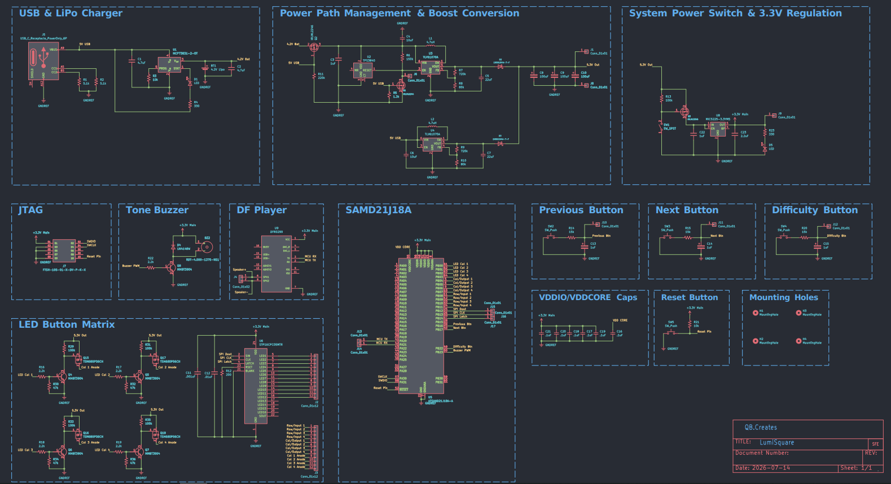
</div>

#### Button Matrix Schematic
<div align="center">
    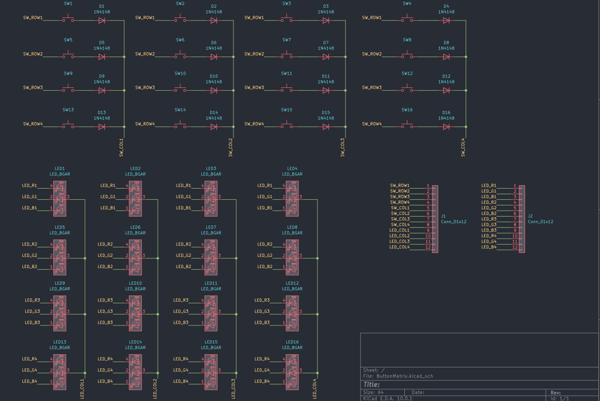
</div>

### PCB Images<a name="pcbimages"></a>
#### Main Control Board
<div align="center">
 <table>
     <tr>
         <td>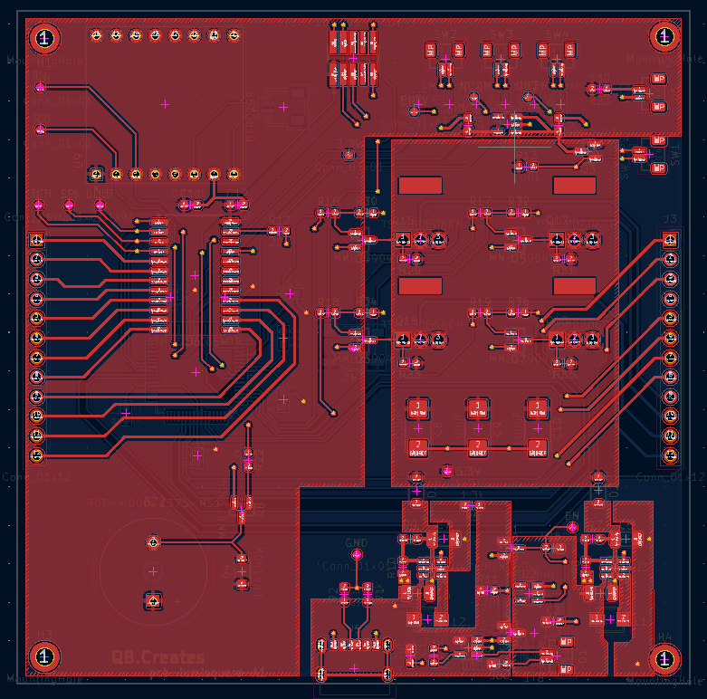</td>
         <td>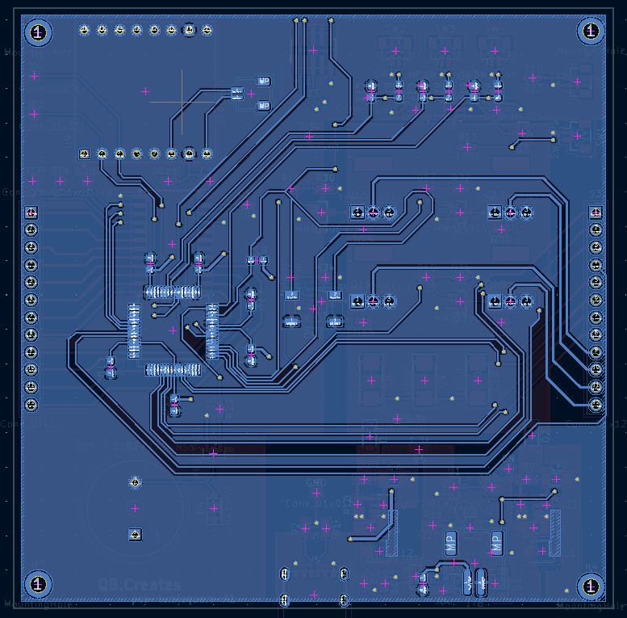</td>
     </tr>
     <tr>
         <td>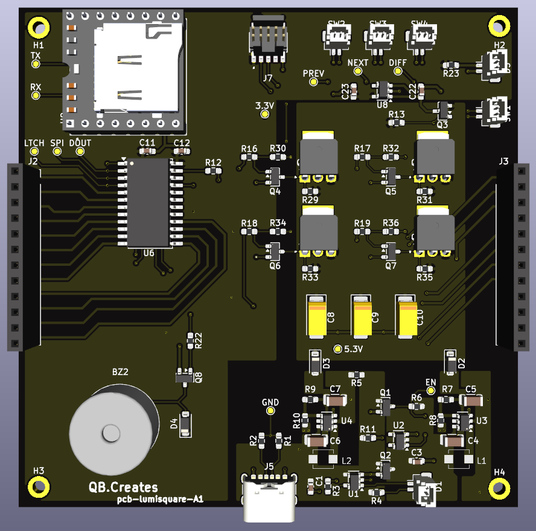</td>
         <td>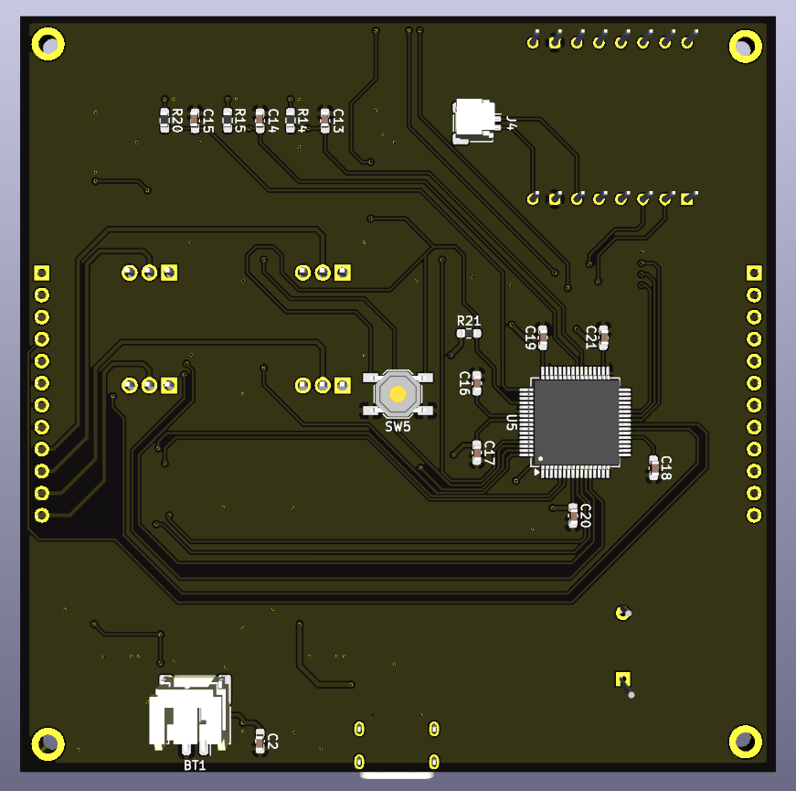</td>
     </tr>
 </table>
</div>

#### Button Matrix
<div align="center">
 <table>
     <tr>
         <td>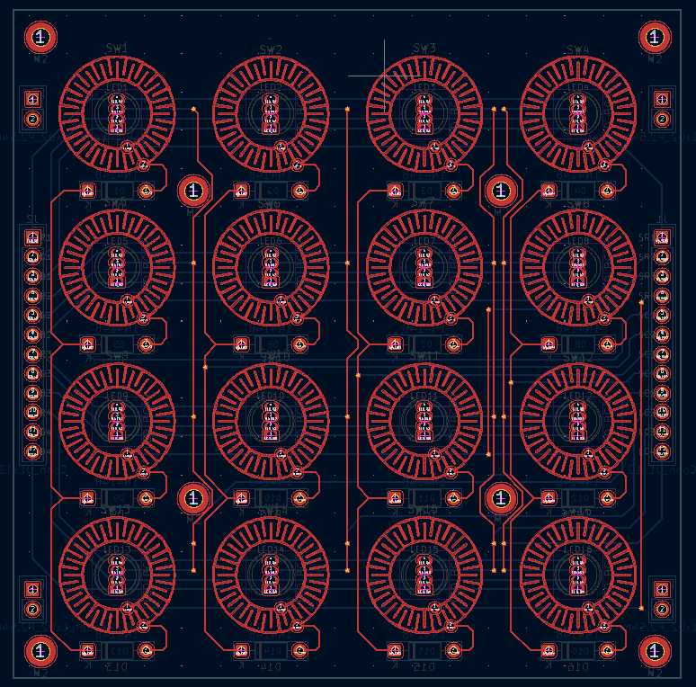</td>
         <td>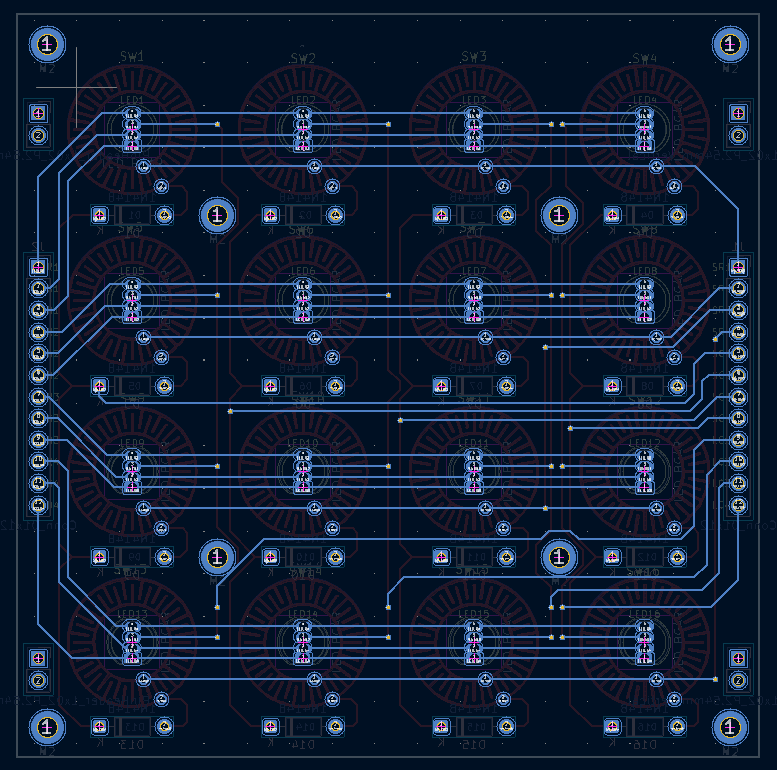</td>
     </tr>
     <tr>
         <td>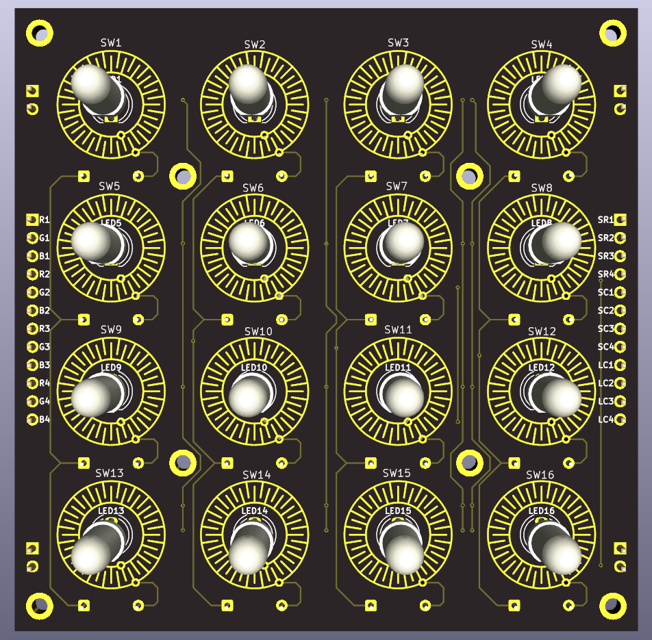</td>
         <td>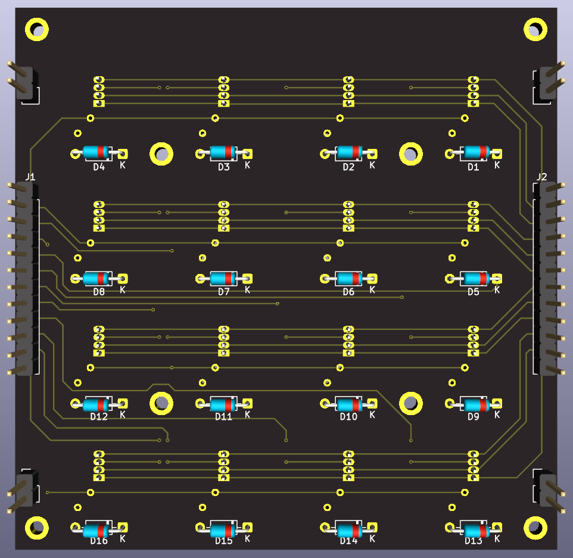</td>
     </tr>
 </table>
</div>

## 3. Pin Mapping <a name="pinmapping"></a>
ATSAMD21J18A pin information is from the Microchip product page and datasheet: https://www.microchip.com/en-us/product/ATSAMD21J18A

### DF Player Mini<a name="dfplayerpins"></a>
| Signal | MCU Pin | DFPlayer Pin | Notes |
|:--|:--|:--|:--|
| USART TX | PA20 | RX (pin 2) | SERCOM5 USART at 9600 baud. 10-byte command frames are pushed out by DMAC channel 0 |
| USART RX | PA21 | TX (pin 3) | SERCOM5 receive interrupt buffers the 20-byte reply and fires the playback completion callback |
| VCC | - | VCC (pin 1) | +3.3 V Main rail |
| GND | - | GND (pin 7) | |
| Speaker + | - | SPK1 (pin 6) | Routed to the J4 JST speaker connector |
| Speaker - | - | SPK2 (pin 8) | Routed to the J4 JST speaker connector |

### Buzzer<a name="buzzerpins"></a>
| Signal | MCU Pin | Notes |
|:--|:--|:--|
| Buzzer PWM | PB23 | TC7 WO[1], match PWM mode, prescaler 256 (187.5 kHz timer clock) |
| | | `CC0` sets the period and therefore the pitch: frequency = 187500 / (CC0 + 1) |
| | | `CC1` is set to `CC0 / 2` for a fixed 50 percent duty cycle |
| | | Drives Q8 (MMBT3904) through R22 (2.2k); D4 (1N4148W) clamps the transducer |

### LED Mapping<a name="ledmapping"></a>
The STP16CPC05 receives one 16-bit word per update, transmitted MSB first over SERCOM4 SPI and then latched. Twelve of the sixteen channels are used, one per row and color combination. The table below shows which data bit and driver output each LED signal is connected to.

|_**STP16CPC05 Outputs**_|Data Bit|Signal|--|_**STP16CPC05 Outputs**_|Data Bit|Signal|
|:--:|:--:|:--:|:--:|:--:|:--:|:--:|
|Out0|Bit 0|Row 1 Red|--|Out6|Bit 6|Row 3 Red|
|Out1|Bit 1|Row 1 Green|--|Out7|Bit 7|Row 3 Green|
|Out2|Bit 2|Row 1 Blue|--|Out8|Bit 8|Row 3 Blue|
|Out3|Bit 3|Row 2 Red|--|Out9|Bit 9|Row 4 Red|
|Out4|Bit 4|Row 2 Green|--|Out10|Bit 10|Row 4 Green|
|Out5|Bit 5|Row 2 Blue|--|Out11|Bit 11|Row 4 Blue|

Out12 through Out15 are unused. In firmware each LED stores a base address for its row (`0x0001`, `0x0008`, `0x0040`, `0x0200`) and derives its green and blue masks by shifting that base left by one and two bits.

Because the row and color lines are shared, the anodes select which column is actually lit. Those column selects and the SPI control lines are:

| Signal | MCU Pin | Schematic Net | Notes |
|:--|:--|:--|:--|
| LED Column 1 | PB0 | LED Col 1 | Left column, drives Q4 into Q15 |
| LED Column 2 | PB1 | LED Col 2 | Drives Q5 into Q17 |
| LED Column 3 | PB2 | LED Col 3 | Drives Q6 into Q16 |
| LED Column 4 | PB3 | LED Col 4 | Right column, drives Q7 into Q18 |
| SPI Data Out | PB12 | SPI Dout | SERCOM4 MOSI into the driver's SIN pin |
| SPI Clock | PB13 | SPI CLK | SERCOM4 SCK |
| SPI Latch | PB14 | SPI Latch | GPIO, pulsed high then low after each 16-bit word |

Firmware addresses the LEDs by a single index from 0 to 15, laid out left to right and top to bottom:

|  |_**Column 1**_|_**Column 2**_|_**Column 3**_|_**Column 4**_|
|:--:|:--:|:--:|:--:|:--:|
|**Row 1**|LED 0|LED 1|LED 2|LED 3|
|**Row 2**|LED 4|LED 5|LED 6|LED 7|
|**Row 3**|LED 8|LED 9|LED 10|LED 11|
|**Row 4**|LED 12|LED 13|LED 14|LED 15|

### 4x4 Button Mapping<a name="buttonmapping"></a>
The matrix is scanned one column at a time. Each column output is driven low in turn while the four row inputs are read; a pressed switch pulls its row line low against the MCU's internal pullup. Every switch has a series 1N4148 diode on the button matrix board so that multiple simultaneous presses cannot ghost.

| Signal | MCU Pin | Schematic Net | Notes |
|:--|:--|:--|:--|
| Column 1 Drive | PB4 | Col/Output 1 | Output, left column |
| Column 2 Drive | PB5 | Col/Output 2 | Output |
| Column 3 Drive | PB6 | Col/Output 3 | Output |
| Column 4 Drive | PB7 | Col/Output 4 | Output, right column |
| Row 1 Sense | PB8 | Row/Input 1 | Input with internal pullup, top row |
| Row 2 Sense | PB9 | Row/Input 2 | Input with internal pullup |
| Row 3 Sense | PB10 | Row/Input 3 | Input with internal pullup |
| Row 4 Sense | PB11 | Row/Input 4 | Input with internal pullup |

`scanButtonMatrix()` returns a 16-bit mask where bit position is `row * 4 + column`, which matches the LED index for the same pad. The table below shows the bit each switch sets and its reference designator on the button matrix board.

|  |_**Column 1**_|_**Column 2**_|_**Column 3**_|_**Column 4**_|
|:--:|:--:|:--:|:--:|:--:|
|**Row 1**|Bit 0 (SW1)|Bit 1 (SW2)|Bit 2 (SW3)|Bit 3 (SW4)|
|**Row 2**|Bit 4 (SW5)|Bit 5 (SW6)|Bit 6 (SW7)|Bit 7 (SW8)|
|**Row 3**|Bit 8 (SW9)|Bit 9 (SW10)|Bit 10 (SW11)|Bit 11 (SW12)|
|**Row 4**|Bit 12 (SW13)|Bit 13 (SW14)|Bit 14 (SW15)|Bit 15 (SW16)|

Three additional buttons live on the main control board and are read directly rather than scanned:

| Signal | MCU Pin | Notes |
|:--|:--|:--|
| Previous Button | PB16 | Input with internal pullup, active low. Cycles backwards through the game list |
| Next Button | PB17 | Input with internal pullup, active low. Cycles forwards through the game list |
| Difficulty / Mute Button | PB22 | Input with internal pullup, active low. Tap to change difficulty, hold for one second to toggle mute |
| Reset | RESET | SW5 push button with a 10k pullup (R21) |

## 4. STL Viewer <a name="stlviewer"></a>
The enclosure was designed in Autodesk Fusion. The full Fusion archive is included alongside the exported meshes: [lumisquare.f3z](3d%20print/lumisquare.f3z)

### Full Design <a name="fulldesign"></a>
- [full-design.stl](3d%20print/full-design.stl)

### Face Plate <a name="faceplate"></a>
- [face-plate.stl](3d%20print/face-plate.stl)

### Back Cover <a name="backcover"></a>
- [back-cover.stl](3d%20print/back-cover.stl)

### Main Body <a name="mainbody"></a>
- [main-body.stl](3d%20print/main-body.stl)

### Main Control Board <a name="maincontrolboardstl"></a>
- [main-control-board.stl](3d%20print/main-control-board.stl)

---

## License
See [LICENSE](LICENSE) for details.
